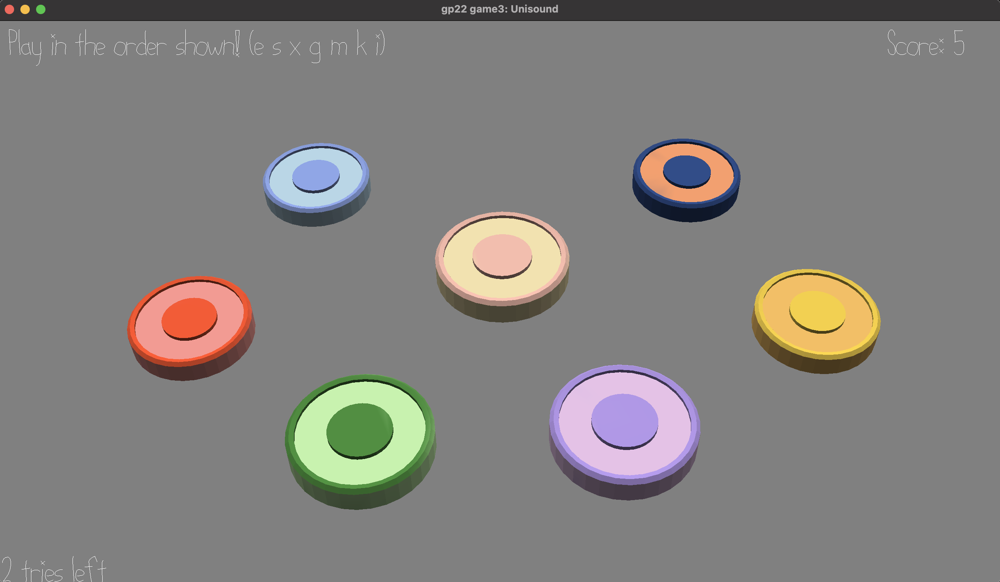

# Unisound

Author: Ashley Kim

Design: Sound pattern memorization game.

## Screen Shot: ##

## How To Play: ##

Press corresponding keys in the order shown! You have 3 tries to play the game, 
and the goal is to memorize as much as possible. 

Keys to use are 'e' 's' 'x' 'g' 'm' 'k' 'i':

Blue : 'e'

Red : 's'

Green : 'x'

Center : 'g'

Purple : 'm'

Yellow : 'k'

Navy : 'i'

## Sounds ##

Sound 1 & 2 made with [JXFR](https://jfxr.frozenfractal.com/).

Sound 3 - 6 made with [BeepBox](https://beepbox.co/).

Sound 7 made with GarageBand.

## Notes ##

If more time, would've implemented reverse twist where the algorithm would choose 
a number from 1-8 instead with 8 being the reverse (reverses the answer vector).

This game was built with [NEST](NEST.md).
